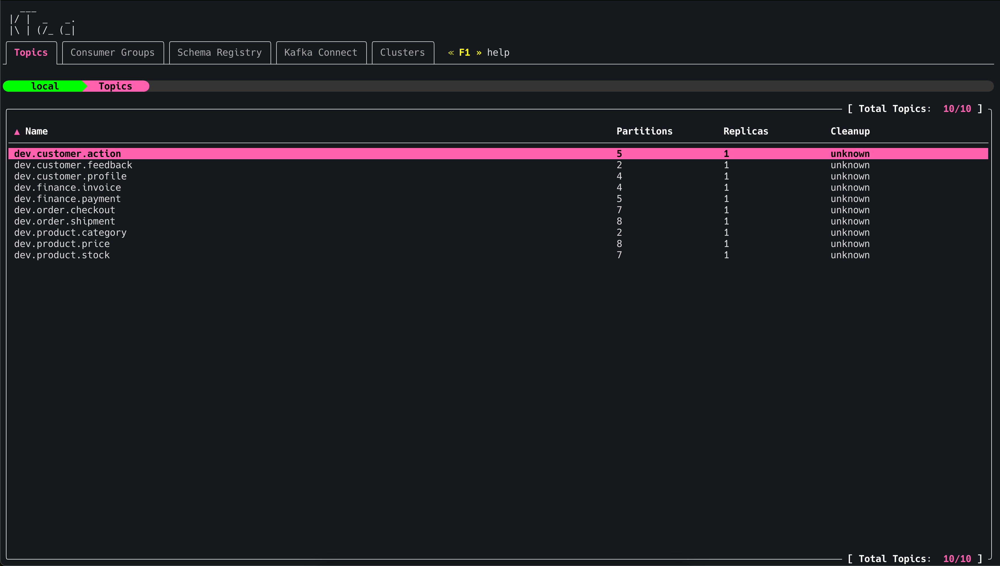
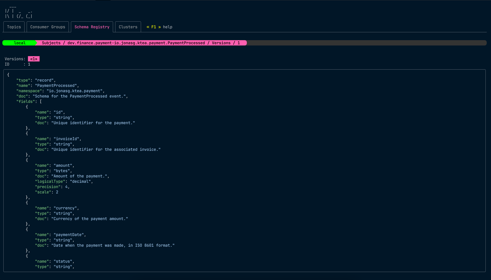
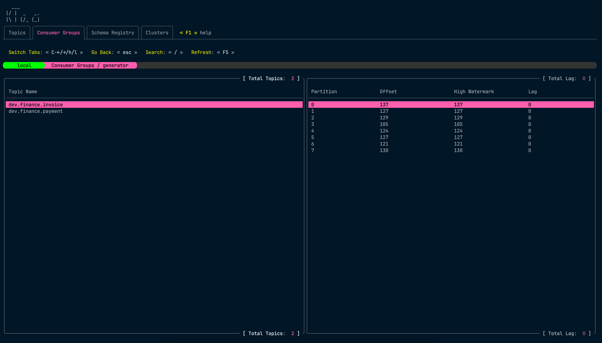

[](https://github.com/jonas-grgt/ktea/releases)
[](https://github.com/jonas-grgt/ktea/actions)
[](https://raw.githack.com/wiki/jonas-grgt/ktea/coverage.html)

# 🫖 ktea - kafka terminal client

ktea is a tool designed to simplify and accelerate interactions with Kafka clusters.

If you're a **k9s** user, you'll love **ktea**!

**List Topics**


**View AVRO Schema**


**View Consumer Lag**


## Installation

### Mac

```sh
brew tap jonas-grgt/ktea
brew install ktea
```

### Linux

Binaries are available at the release page.

### Windows

Binaries are available at the release page.

## Usage

### Navigation

All tables can be navigated using vi like bindings:
- up: `j`
- down: `k`
- page down: `d`
- page up: `u`

### Configuration

All configuration is stored in `~/.config/ktea/config.yaml`

All cluster configurations can be managed through the TUI even the initial one.

Example configuration file:

```yaml
plain-fonts: true # when nerd-fonts are not available, set to true
clusters:
    - name: local
      color: '#FF0000'
      active: true
      servers:
          - localhost:9093
      sasl:
          authMethod: NONE
      tls:
          enable: true
          skipVerify: false
          caCertPath: "docker/cert/ca.crt"
      schema-registry:
          url: http://localhost:8081
          username: "user"
          password: "secret"
      kafka-connect-clusters:
          - name: PRD
            url: http://localhost:8083
            username: "admin"
            password: "secret"
```

### Cluster Management

Multiple clusters can be added.
Upon startup when no cluster is configured, you will be prompted
to add one.

#### TLS support

- TLS can be enabled by setting `tls.enabled` to true in the cluster configuration.
- `tls.skipVerify` can be set to true to skip TLS certificate verification (not recommended for production).
- `tls.caCertPath` can be set to the path of the CA certificate to use

#### Supported Auth Methods

- None (no authentication)
- SASL 
    - Plaintext

## Features

- *Multi-Cluster Support*: Seamlessly connect to multiple Kafka clusters and switch between them with ease.
- *Topic Management*: List, create, delete, and modify topics, including partition and offset details.
- *Record Consumption*: Consume records in text, JSON, and **Avro** formats, with powerful search capabilities.
- *Consumer Group Insights*: Monitor consumer groups, view their members, and track offsets.
- *Schema Registry Integration*: Browse, view, and register schemas effortlessly.
- *Kafka Connect Integration*: Browse, view, and Update clusters.

## Todo

- Add more authentication methods
- Add support for more message formats such as protobuf.
- Add ACL management.
- File based import/export of topics.
- Add ability to delete specific schema versions.
- Add consumption templating support.
- Many more, just file an issue requesting a feature!

## Development

### Dev cluster setup

A docker-compose setup is provided to quickly spin up a local Kafka cluster with pre-created topics, consumer groups,
commited offsets etc ...

`docker/docker-compose.yml` contains a cluster, schema-registry and kafka-connect setup.
`docker/docker-compose-ssl.yml` contains a ssl enabled cluster only

### Generate data

After the local cluster is up and running, you can generate some data to work with, 
using`go run ./cmd/generate`.

### Run `ktea`

Use `go run -tags dev cmd/ktea/main.go` to run `ktea` from the root of the repository.

> Note: running the tui with dev build tag will simulate an artificial slow network by sleeping for 2 seconds when doing network IO. This way the loaders and spinners can be visually asserted.
> 

### Run tests

Because of interfering testcontainers kafka brokers the tests, for now, can't be run in parallel.
This will be fixed in the future.

```sh
go test -count=1 ./...  -p 1
```
